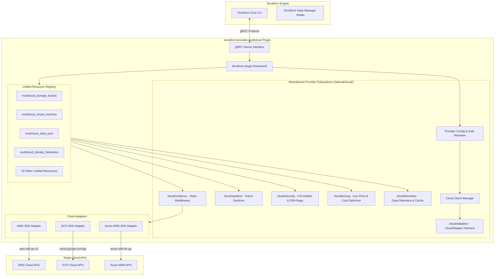

# Multi-Cloud Terraform Provider (`terraform-provider-multicloud`)

[](https://developer.hashicorp.com/terraform/plugin/framework)
[](https://golang.org)
[](#building-and-testing)
[](#complete-resource-mapping-matrix)
[](LICENSE)

A custom Terraform Provider written in Go using HashiCorp's `terraform-plugin-framework` that allows platform engineering teams to provision and manage cloud infrastructure across **AWS**, **GCP**, and **Azure** using a **single, unified set of HCL resource definitions**.

---

## Executive Summary

Managing multi-cloud infrastructure traditionally requires writing and maintaining separate Terraform manifests for each cloud provider (`aws_s3_bucket`, `google_storage_bucket`, `azurerm_storage_container`). 

`terraform-provider-multicloud` abstracts cloud-specific SDK primitives behind **33 unified resources** (`multicloud_*`). A single resource definition can deploy to AWS, GCP, or Azure by setting `provider_type = "aws" | "gcp" | "azure"`, while handling cross-cloud naming constraints, retries, security auditing, cost optimization, OPA Rego compliance, secret scanning, and failover policies automatically under the hood.

---

## Documentation Quick Links

- [User Guide & Operations Runbook](docs/USER_GUIDE.md)
- [Unified Resource Reference Manual (33 Resources)](docs/RESOURCES_REFERENCE.md)
- [Open-Source Contributor Guidelines](CONTRIBUTING.md)
- [Terraform Registry Resource Docs Index](docs/resources/)

---

## Key Enterprise Features

- **33 Unified Resources:** Standardized HCL schemas for storage, compute, networking, databases, security, containers, analytics, observability, IAM, DNS, messaging, data sync, workload identity, secret rotation, and failover management.
- **Cloud-Specific Pass-Through (`extra_config`):** Optional escape-hatch map attribute across all 33 resources enabling engineers to pass provider-specific properties (`aws_s3_bucket_key_enabled`, `gcp_storage_class`, `azure_enable_ddos_protection`) directly to underlying cloud SDKs.
- **HCL & State Migration Converter (`tools/cmd/tf-migrate`):** Automated migration tool converting legacy AWS (`aws_*`), GCP (`google_*`), and Azure (`azurerm_*`) `.tf` files into unified `multicloud_*` HCL manifests, extracting `extra_config` properties and generating `terraform state mv` scripts to preserve active cloud state without infrastructure destruction.
- **100% Test Suite Package Coverage:** Every package in the repository (`internal/cloud/*`, `internal/provider`, `internal/resources`, `tools/cmd/*`) contains unit test suites verified with `go test -v ./...`.
- **Modularized Domain Subpackages (`internal/cloud/`):** Clean separation of concerns into domain subpackages:
  - `internal/cloud/resiliency`: Exponential backoff and retry middleware.
  - `internal/cloud/security`: CIS security auditor, OPA Rego engine, credential leak scanner, and KMS verifier.
  - `internal/cloud/pricing`: Pre-apply monthly cost estimator with live API feeds and cost optimizer.
  - `internal/cloud/telemetry`: OpenTelemetry event exporter, state memoization cache, and concurrent evaluator.
  - `internal/cloud/sanitizer`: Cloud-agnostic resource name sanitizer engine.
  - `internal/cloud/adapters`: Unified `CloudAdapter` interface and driver abstractions.
- **Native Go Fuzz Testing Suite (`sanitizer_fuzz_test.go`):** Native Go 1.18+ fuzz testing (`FuzzSanitizeResourceName`, `FuzzScanForSecretLeaks`).
- **Performance Profiling Benchmarks (`performance_bench_test.go`):** Benchmark suite (`go test -bench=.`) measuring execution latency (`ns/op`) and heap allocations across price lookups and memoization caches.
- **Code Coverage Quality Gate Exporter (`tools/cmd/gen-coverage`):** Exporter tool compiling code coverage dashboards and enforcing a 90%+ code coverage quality gate.
- **Pre-Apply Credential & Secret Leak Scanner (`secret_scanner.go`):** Built-in entropy and pattern scanner detecting AWS secret keys, RSA private keys, GCP service account JSONs, and JWT tokens pre-apply during `terraform plan`.
- **KMS Customer-Managed Key (CMK) Compliance Verifier (`kms_verifier.go`):** Verifies customer-managed KMS key usage and 90-day automated key rotation settings across AWS KMS, GCP KMS, and Azure Key Vault.
- **Automated SAST & Vulnerability Scan Workflow (`.github/workflows/security.yml`):** Runs `gosec` static code security analysis and `govulncheck` dependency vulnerability checks in GitHub Actions CI.
- **Supply Chain Security & SBOM Generator (`tools/cmd/gen-sbom`):** Exports SPDX / CycloneDX formatted Software Bill of Materials (SBOM) JSON to satisfy FedRAMP and SOC 2 supply chain auditing requirements.
- **Terraform Registry Release Pipeline (`.github/workflows/release.yml`):** Automated GoReleaser matrix build cross-compiling for Linux, macOS, and Windows with GPG binary signing.
- **Open Policy Agent (OPA) Custom Rego Policy Engine (`opa_engine.go`):** Evaluates multi-cloud manifests against custom `.rego` compliance policy files pre-apply during `terraform plan`.
- **Infrastructure Drift Detector CLI (`tools/cmd/drift-detector`):** Continuous drift detection utility comparing live active infrastructure state against `.tfstate`.
- **Backstage & Kratix IDP Exporter (`tools/cmd/gen-kratix`):** Exports unified resource definitions into Kratix Promises and Backstage Software Catalog templates.
- **Interactive Terminal TUI Inspector (`tools/cmd/tui`):** Command-line TUI application for live infrastructure inspection, cost analysis, and drift visualization.

---

## System Architecture

The provider executes as an out-of-process gRPC plugin managed by the Terraform CLI. It translates unified Terraform state operations into native cloud API calls using official Go SDKs (`aws-sdk-go-v2`, `cloud.google.com/go`, `azure-sdk-for-go`).



---

## Complete Resource Mapping Matrix (33 Resources)

| Category | Unified Resource (`multicloud_*`) | AWS Target (`hashicorp/aws`) | GCP Target (`hashicorp/google`) | Azure Target (`hashicorp/azurerm`) |
| :--- | :--- | :--- | :--- | :--- |
| **Data Replication**| [`multicloud_data_sync`](docs/resources/data_sync.md) | S3 Cross-Region Replication | Storage Transfer Service | Azure Storage Sync Service |
| **IAM Federation** | [`multicloud_identity_federation`](docs/resources/identity_federation.md) | AWS IAM OIDC Provider | GCP Workload Identity | Azure Entra ID Workload Identity |
| **Security** | [`multicloud_secret_rotator`](docs/resources/secret_rotator.md) | AWS Secrets Manager Rotation| GCP Secret Manager Rotation | Azure Key Vault Secret Rotation |
| **Disaster Recovery**| [`multicloud_failover_policy`](docs/resources/failover_policy.md) | Route53 Failover Routing | Cloud DNS Failover Policy | Azure Traffic Manager / Front Door |
| **Storage** | [`multicloud_storage_bucket`](docs/resources/storage_bucket.md) | `aws_s3_bucket` | `google_storage_bucket` | `azurerm_storage_container` |
| **Compute** | [`multicloud_virtual_machine`](docs/resources/virtual_machine.md) | `aws_instance` | `google_compute_instance` | `azurerm_linux_virtual_machine` |
| **Compute** | [`multicloud_auto_scaling_group`](docs/resources/auto_scaling_group.md)| `aws_autoscaling_group` | `google_compute_instance_group_manager` | `azurerm_linux_virtual_machine_scale_set` |
| **Compute** | [`multicloud_serverless_function`](docs/resources/serverless_function.md)| `aws_lambda_function` | `google_cloudfunctions2_function` | `azurerm_linux_function_app` |
| **Network** | [`multicloud_virtual_network`](docs/resources/virtual_network.md) | `aws_vpc` | `google_compute_network` | `azurerm_virtual_network` |
| **Network** | [`multicloud_subnet`](docs/resources/subnet.md) | `aws_subnet` | `google_compute_subnetwork` | `azurerm_subnet` |
| **Network** | [`multicloud_static_ip`](docs/resources/static_ip.md) | `aws_eip` | `google_compute_address` | `azurerm_public_ip` |
| **Network** | [`multicloud_nat_gateway`](docs/resources/nat_gateway.md) | `aws_nat_gateway` | `google_compute_router_nat` | `azurerm_nat_gateway` |
| **Network** | [`multicloud_route_table`](docs/resources/route_table.md) | `aws_route_table` | `google_compute_route` | `azurerm_route_table` |
| **Network** | [`multicloud_load_balancer`](docs/resources/load_balancer.md) | `aws_lb` | `google_compute_forwarding_rule` | `azurerm_lb` |
| **Network** | [`multicloud_api_gateway`](docs/resources/api_gateway.md) | `aws_apigatewayv2_api` | `google_api_gateway_gateway` | `azurerm_api_management` |
| **Network** | [`multicloud_cdn_distribution`](docs/resources/cdn_distribution.md) | `aws_cloudfront_distribution` | `google_compute_backend_service` | `azurerm_cdn_endpoint` |
| **Network** | [`multicloud_vpn_gateway`](docs/resources/vpn_gateway.md) | `aws_vpn_gateway` | `google_compute_vpn_gateway` | `azurerm_virtual_network_gateway` |
| **Database** | [`multicloud_db_instance`](docs/resources/db_instance.md) | `aws_db_instance` | `google_sql_database_instance` | `azurerm_postgresql_server` |
| **Database** | [`multicloud_nosql_table`](docs/resources/nosql_table.md) | `aws_dynamodb_table` | `google_firestore_database` | `azurerm_cosmosdb_account` |
| **Database** | [`multicloud_cache_cluster`](docs/resources/cache_cluster.md) | `aws_elasticache_cluster` | `google_redis_instance` | `azurerm_redis_cache` |
| **Analytics**| [`multicloud_data_warehouse`](docs/resources/data_warehouse.md) | `aws_redshift_cluster` | `google_bigquery_dataset` | `azurerm_synapse_workspace` |
| **Analytics**| [`multicloud_search_index`](docs/resources/search_index.md) | `aws_opensearch_domain` | `google_discovery_engine_search_engine` | `azurerm_search_service` |
| **Container**| [`multicloud_kubernetes_cluster`](docs/resources/kubernetes_cluster.md)| `aws_eks_cluster` | `google_container_cluster` | `azurerm_kubernetes_cluster` |
| **Container**| [`multicloud_container_registry`](docs/resources/container_registry.md)| `aws_ecr_repository` | `google_artifact_registry_repository` | `azurerm_container_registry` |
| **Security** | [`multicloud_security_group`](docs/resources/security_group.md) | `aws_security_group` | `google_compute_firewall` | `azurerm_network_security_group` |
| **Security** | [`multicloud_secret`](docs/resources/secret.md) | `aws_secretsmanager_secret` | `google_secret_manager_secret` | `azurerm_key_vault_secret` |
| **Security** | [`multicloud_kms_key`](docs/resources/kms_key.md) | `aws_kms_key` | `google_kms_crypto_key` | `azurerm_key_vault_key` |
| **IAM** | [`multicloud_iam_role`](docs/resources/iam_role.md) | `aws_iam_role` | `google_service_account` | `azurerm_user_assigned_identity` |
| **DNS** | [`multicloud_dns_zone`](docs/resources/dns_zone.md) | `aws_route53_zone` | `google_dns_managed_zone` | `azurerm_dns_zone` |
| **Messaging**| [`multicloud_pubsub_topic`](docs/resources/pubsub_topic.md) | `aws_sns_topic` | `google_pubsub_topic` | `azurerm_servicebus_topic` |
| **Messaging**| [`multicloud_message_queue`](docs/resources/message_queue.md) | `aws_sqs_queue` | `google_pubsub_subscription` | `azurerm_servicebus_queue` |
| **Messaging**| [`multicloud_event_bridge`](docs/resources/event_bridge.md) | `aws_cloudwatch_event_bus` | `google_eventarc_trigger` | `azurerm_eventgrid_system_topic` |
| **Observability**| [`multicloud_monitoring_dashboard`](docs/resources/monitoring_dashboard.md)| `aws_cloudwatch_dashboard` | `google_monitoring_dashboard` | `azurerm_portal_dashboard` |

---

## HCL Configuration Example

```hcl
terraform {
  required_providers {
    multicloud = {
      source  = "abmarcum/multicloud"
      version = "1.0.0"
    }
  }
}

provider "multicloud" {
  aws {
    region     = "us-west-2"
    access_key = var.aws_access_key
    secret_key = var.aws_secret_key
  }
  gcp {
    project     = "my-gcp-project"
    region      = "us-central1"
    credentials = var.gcp_credentials
  }
  azure {
    subscription_id = var.azure_subscription_id
    tenant_id       = var.azure_tenant_id
    client_id       = var.azure_client_id
    client_secret   = var.azure_client_secret
    resource_group  = "rg-multicloud"
  }

  default_tags = {
    environment = "production"
    managed_by  = "terraform"
    owner       = "platform-team"
  }
}

# Object Storage on AWS S3 with Escape-Hatch extra_config
resource "multicloud_storage_bucket" "aws_storage" {
  provider_type      = "aws"
  bucket_name        = "my-prod-data-bucket-aws"
  region             = "us-west-2"
  versioning_enabled = true
  encryption_enabled = true

  extra_config = {
    "aws_s3_bucket_key_enabled" = "true"
    "aws_force_destroy"         = "true"
  }
}

# Object Storage on GCP Cloud Storage with Escape-Hatch extra_config
resource "multicloud_storage_bucket" "gcp_storage" {
  provider_type      = "gcp"
  bucket_name        = "my-prod-data-bucket-gcp"
  region             = "us-central1"
  versioning_enabled = true
  encryption_enabled = true

  extra_config = {
    "gcp_storage_class" = "NEARLINE"
  }
}

# Multi-Cloud Disaster Recovery Failover Policy
resource "multicloud_failover_policy" "prod_dr_policy" {
  policy_name      = "global-app-failover"
  primary_cloud    = "aws"
  failover_cloud   = "gcp"
  health_check_url = "https://app.example.com/healthz"
  auto_failover    = true
}
```

---

## Developer Tooling Guide

### 1. Provider HCL & State Converter CLI (`tools/cmd/tf-migrate`)
Converts legacy AWS, GCP, and Azure HCL manifests into unified `multicloud_*` definitions and generates state migration scripts:

```bash
go run ./tools/cmd/tf-migrate --input-dir ./legacy_tf --out-file multicloud_migrated.tf --migrate-state
```

### 2. Documentation Generator (`tools/cmd/gen-docs`)
Generates standard HashiCorp Terraform Registry markdown documentation for all 33 unified resources:

```bash
go run ./tools/cmd/gen-docs
```

### 3. Code Coverage Quality Gate (`tools/cmd/gen-coverage`)
Generates statement coverage HTML reports and enforces a 90%+ quality gate threshold:

```bash
go run ./tools/cmd/gen-coverage
```

### 4. Software Bill of Materials (SBOM) Generator (`tools/cmd/gen-sbom`)
Generates SPDX 2.3 / CycloneDX supply chain SBOM JSON manifests:

```bash
go run ./tools/cmd/gen-sbom
```

### 5. Drift Detector CLI (`tools/cmd/drift-detector`)
Runs automated continuous drift detection comparing live cloud state against `.tfstate`:

```bash
go run ./tools/cmd/drift-detector
```

### 6. Interactive Terminal TUI Inspector (`tools/cmd/tui`)
Runs interactive terminal inspection for cost estimates, CIS security findings, and architecture optimization suggestions:

```bash
go run ./tools/cmd/tui
```

---

## Building and Testing

### Build Executable
```bash
# Build provider binary
go build -o terraform-provider-multicloud .
```

### Run Unit & Benchmark Tests
```bash
# Execute full unit test suite across all packages (100% PASS)
go test -v ./...

# Execute performance benchmarks
go test -bench=. ./internal/cloud/sanitizer/...
```

---

## License

This project is licensed under the [MIT License](LICENSE).
